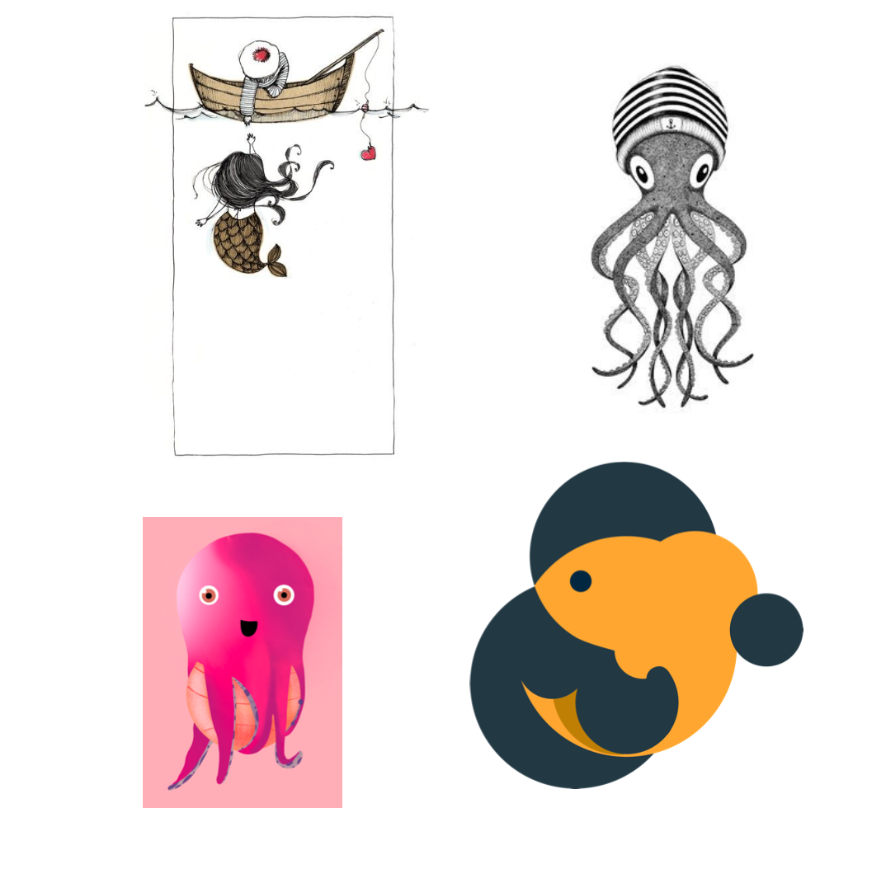
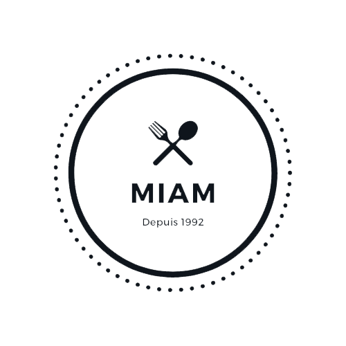

# Application site d'une crêperie

**But :** Retravailler l'interface d'une application mobile permettant d'afficher le menu d'une crêperie grâce à un QR Code. REMPLACER UN MENU PAPIER (contexte actuel = Covid19)

**Travail à faire :**
- Retravailler l'identité graphique de la crêperie
- Affichage clair et accessible
- ...

**Problématique :** En raison du Covid19, le restaurant ne distribue plus de menu en format papier et demande à ses clients de flasher un QR Code sur leur table pour pouvoir avoir accès au menu mais ce dernier s'affiche mal et n'ai pas facilement accessible ce qui oblige certains clients à demander la version papier

Pour le moment, s'il on souhaite avoir accès au menu, il faut agrandir ce qui n'est pas pratique tout et ne permet pas de voir l'ensemble de la carte.

Le site est mal organisé et confus, il y a trop d’informations sur la page d’accueil, il n’est pas responsive.

TRAVAILLER SUR LES PERSONAS

- Jeunes entre amis (sont toujours équipés d'un smartphone et sont ultra connectés)
- Les familles avec enfants (sont souvent équipées d'un smartphone mais ne sont pas toujours connectées)
- Les personnes plus âgées (plus de 55 ans) (ne sont pas toujours équipées d'un smartphone et sont encore moins équipées)

**Moodboard :**

Pour le côté graphique, travailler autour du côté maritime, de la marinière ou encore de la pieuvre (travail en noir et blanc avec une légère touche de couleur)

Réalisation du nouveau logo de la crêperie **MIAM**

TO DO :

- Début de la réalisation de la maquette (en cours)
- Faire les liens entre les différents éléments du prototype (en cours)
- Rédiger un article autour de la démarche mise en place pour réaliser ce projet

**A garder en tête :**
###### UNE BONNE DEMARCHE UTILISATEUR DOIT SE BASER SUR PLUSIEURS ETAPES :

- Une phase de **DECOUVERTE** & de **RECHERCHE** permettant de comprendre l'environnement de travail et les utilisateurs
- Une phase de **DEFINITION** & d'**ANALYSE** afin de définir l’approche design qui permettant de concevoir l’expérience en fonction du point de vue de l’utilisateur et des problématiques soulevées
- Une phase d'**IDEATION** permettant d'exploiter les idées soulevées lors des ateliers afin de transformer les problèmes en solutions
- Une phase de **PROTOTYPAGE** & de **TEST** donnant vie aux idées tout en les testant afin de les ajuster au mieux pour qu'elles puissent répondre aux attentes des utilisateurs
- Une phase de **DESIGN D'INTERFACE**
