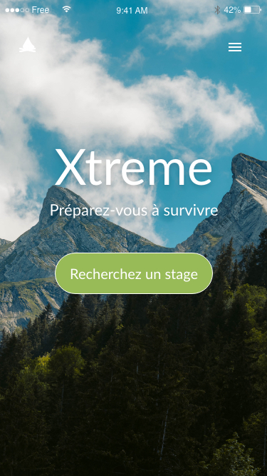
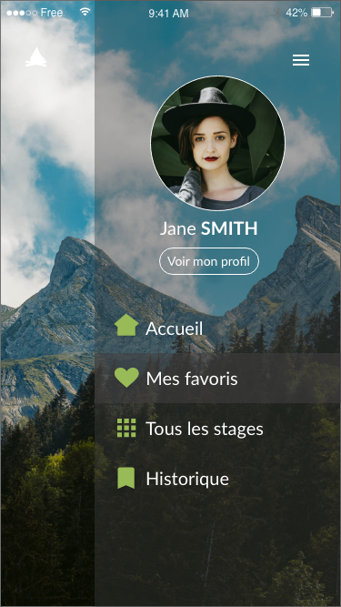
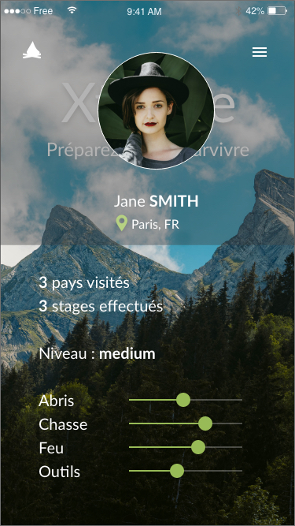
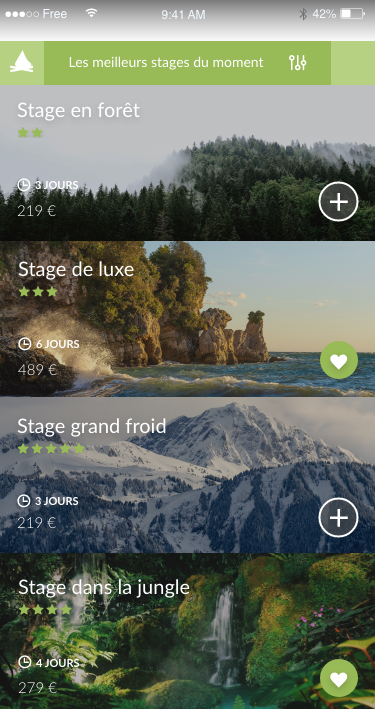
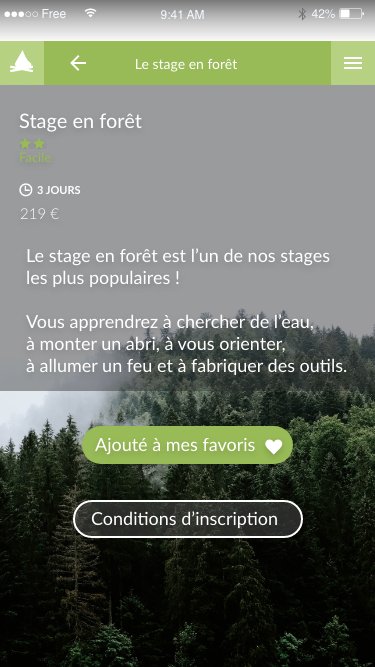

# Projets-UX-UI

Ce repository contient plusieurs maquettes de sites web et d'applications mobiles fait avec le logiciel AdobeXD

###### UNE BONNE DEMARCHE UTILISATEUR DOIT SE BASER SUR PLUSIEURS ETAPES :

- Une phase de **DECOUVERTE** & de **RECHERCHE** permettant de comprendre l'environnement de travail et les utilisateurs
- Une phase de **DEFINITION** & d'**ANALYSE** afin de définir l’approche design qui permettant de concevoir l’expérience en fonction du point de vue de l’utilisateur et des problématiques soulevées
- Une phase d'**IDEATION** permettant d'exploiter les idées soulevées lors des ateliers afin de transformer les problèmes en solutions
- Une phase de **PROTOTYPAGE** & de **TEST** donnant vie aux idées tout en les testant afin de les ajuster au mieux pour qu'elles puissent répondre aux attentes des utilisateurs
- Une phase de **DESIGN D'INTERFACE**

## Application Xtreme

###### Projet réalisé en septembre 2020

Prototype d'une application mobile permettant de reserver des stages en pleine nature. Ce prototype est en haute fidélité et est composée d'une page d'accueil, d'un menu, d'une page profil et de plusieurs pages de présentation de stage.

Le prototype de l'application est disponible en format .xd (AdobeXD)

Voici quelques screenshot de l'application :

Page d'accueil de l'application

Menu

Page profil

Page choix des stages

Page présentation stage

## Page d'accueil de l'année culturelle France/Japon

###### Projet réalisé entre août et septembre 2020

Prototype haute fidélité d'une page d'accueil d'un site internet (année culturelle France/Japon). Après avoir réalisé le prototype, j'ai codé la page en HTML/CSS.

Création de l'illustration avec Adobe Photoshop

Le prototype de l'application est disponible en format .xd (AdobeXD) et vous avez également accès au code de la page.

Page d'accueil de l'application

## Application Puppy

###### Projet réalisé en juin 2020

Prototype haute fidélité réalisé dans le cadre de ma formation OpenClassRooms et fait avec le logiciel AdobeXD. Dans ce cours, j'ai pu apprendre les bases du prototypage en créant des call to action, une page de profil, une page d'accueil ou encore une page défilement. J'ai fait attention aux liens entre les différentes pages afin de créer une application dynamique.

Le prototype de l'application est disponible au format .xd (AdobeXD)

Voici quelques screenshot :

Page d'accueil de l'application

Page profil

Page de présentations des chiots
