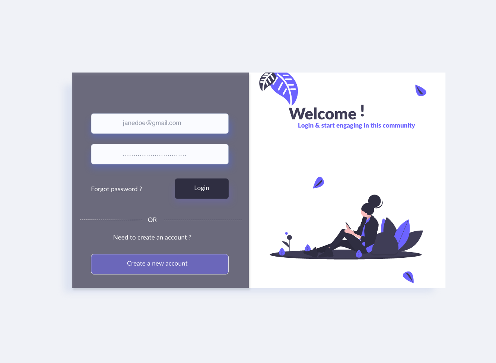
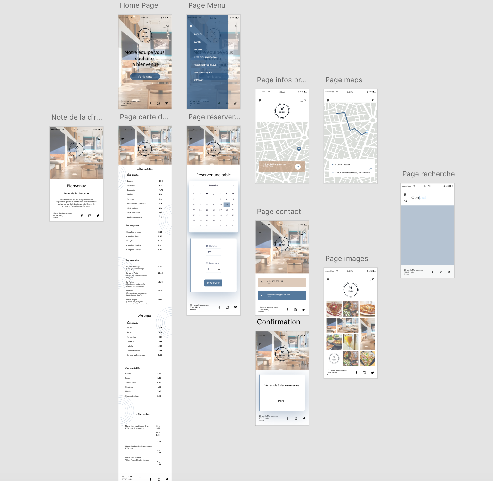
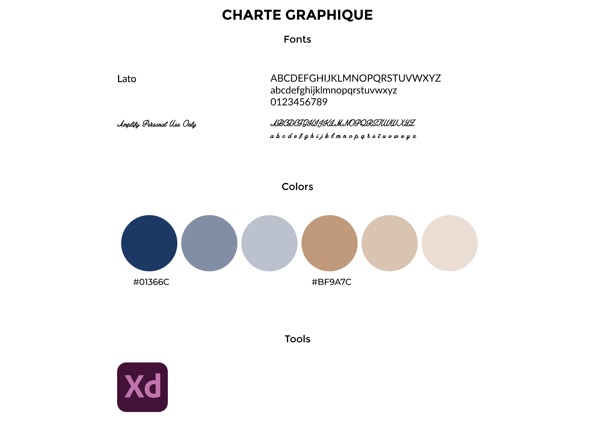
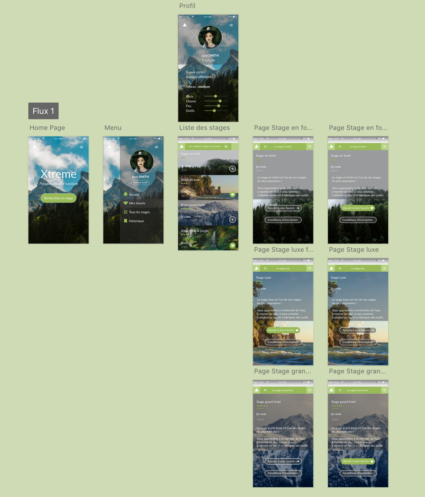
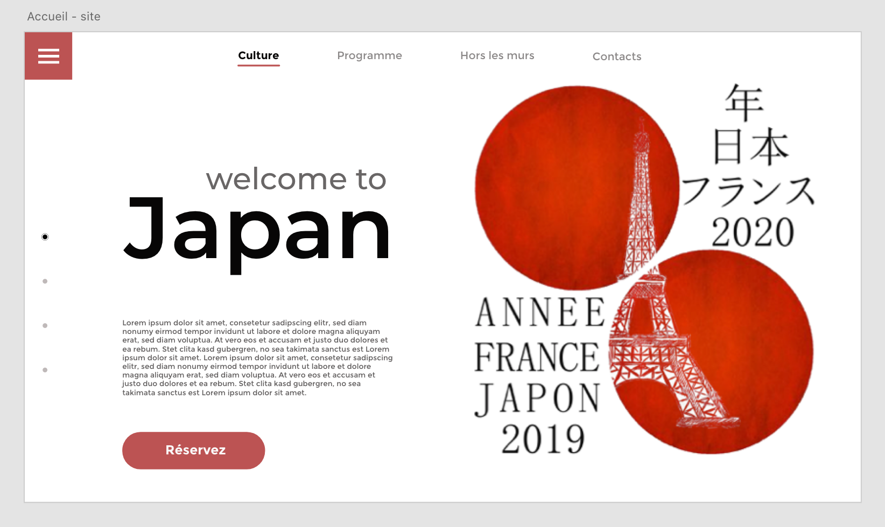
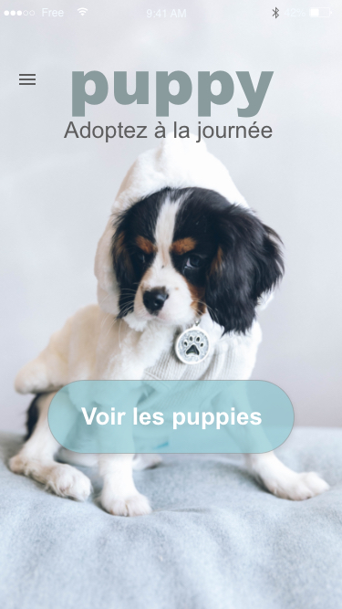
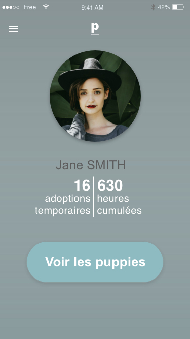
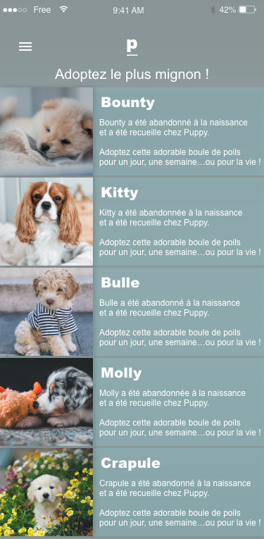

# Projets

Projets personnels me permettant de mettre en pratique mes connaissances en UX/UI et solidifier mes compétences.

###### UNE BONNE DEMARCHE UTILISATEUR DOIT SE BASER SUR PLUSIEURS ETAPES :

- Une phase de **DECOUVERTE** & de **RECHERCHE** permettant de comprendre l'environnement de travail et les utilisateurs
- Une phase de **DEFINITION** & d'**ANALYSE** afin de définir l’approche design qui permettant de concevoir l’expérience en fonction du point de vue de l’utilisateur et des problématiques soulevées
- Une phase d'**IDEATION** permettant d'exploiter les idées soulevées lors des ateliers afin de transformer les problèmes en solutions
- Une phase de **PROTOTYPAGE** & de **TEST** donnant vie aux idées tout en les testant afin de les ajuster au mieux pour qu'elles puissent répondre aux attentes des utilisateurs
- Une phase de **DESIGN D'INTERFACE**

## Page de connexion

###### Projet réalisé en octobre 2020

Réalisation d'une page de connexion

Prototype disponible en format .xd (AdobeXD)

## Application site d'une crêperie

###### Projet réalisé en octobre 2020

**But :** Retravailler l'interface d'une application mobile permettant d'afficher le menu d'une crêperie grâce à un QR Code. REMPLACER UN MENU PAPIER (contexte actuel = Covid19)

Le prototype de l'application mobile est disponible en format .xd (AdobeXD)

Voici à quoi ressemble l'application :

## Application Xtreme

###### Projet réalisé en septembre 2020

Dans le cadre d’un cours suivi sur la plateforme Openclassrooms, j’ai réalisé la maquette d’une application mobile fictive : « Xtreme ». La conception de cette maquette m'a permis de comprendre comment prendre en compte des considérations importantes en design d’interface telle que l’usabilité, l’interaction ou le principe d’affordance.

Le prototype de l'application est disponible en format .xd (AdobeXD)

Voici à quoi ressemble l'application :

## Page d'accueil de l'année culturelle France/Japon

###### Projet réalisé entre août et septembre 2020

Prototype haute fidélité d'une page d'accueil d'un site internet (année culturelle France/Japon). Après avoir réalisé le prototype, j'ai codé la page en HTML/CSS.

Création de l'illustration avec Adobe Photoshop

Le prototype de l'application est disponible en format .xd (AdobeXD) et vous avez également accès au code de la page.

Page d'accueil de l'application

## Application Puppy

###### Projet réalisé en juin 2020

Prototype haute fidélité réalisé dans le cadre de ma formation OpenClassRooms et fait avec le logiciel AdobeXD. Dans ce cours, j'ai pu apprendre les bases du prototypage en créant des call to action, une page de profil, une page d'accueil ou encore une page défilement. J'ai fait attention aux liens entre les différentes pages afin de créer une application dynamique.

Le prototype de l'application est disponible au format .xd (AdobeXD)

Voici quelques screenshot :

Page d'accueil de l'application

Page profil

Page de présentations des chiots
